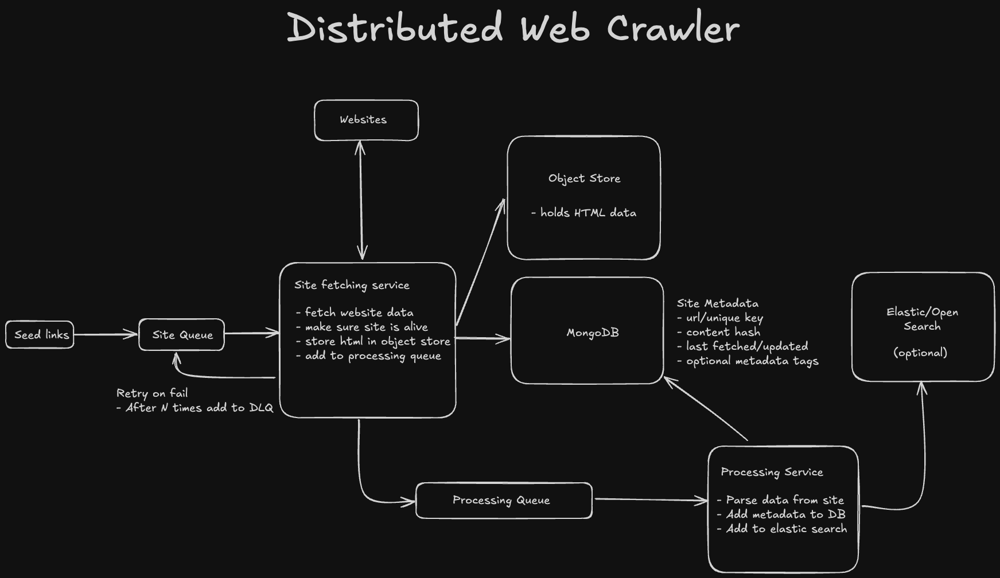

# Distributed Web Crawler

My attempt at making a distributed web crawler using Golang, Kafka, MongoDB, and Elasticsearch.

## Motivation
Part of the motivation for this project was as part of building a new website for my grandfather's work, there was lots of content on many pages that would have to be transferred to the new website. I thought it would be a good idea to make a web crawler that would crawl the old website and store the content in a database. This way I could easily transfer the content to the new website.

At the same time, I wanted to learn more about distributed systems and Kafka in particular, so I decided to make use of Kafka to help manage the distribution of the page crawling. I also wanted to further my experience working with Go and MongoDB, so this was a perfect project to do so.

## Architecture
The architecture of the system is as follows:

The system is made up of 2 main services:
- Site fetching service:
    - This service is responsible for fetching the HTML content (and therefore making sure it is alive) of a website and storing it to an object store, such as AWS S3.
    - The service then adds the message to another queue for processing, which is consumed by the processing service
    - The service is also responsible for managing retries in case a site is unreachable on first fetch, re-assigning them to the site queue until a threshold is reached then placing them on a dead letter queue (DLQ).
- Site processing service:
    - This service is responsible for processing the HTML content of a website and extracting the links and content from the page.
        - This includes extracting the title, meta tags, other links, and text body of the page.
    - The service then stores the extracted content in a database, such as MongoDB, and to a search service, such as Elasticsearch for lookup (optional).
    - The service then adds the extracted links to the queue for the site fetching service to fetch, if they haven't already been ingested into the MongoDB database.
